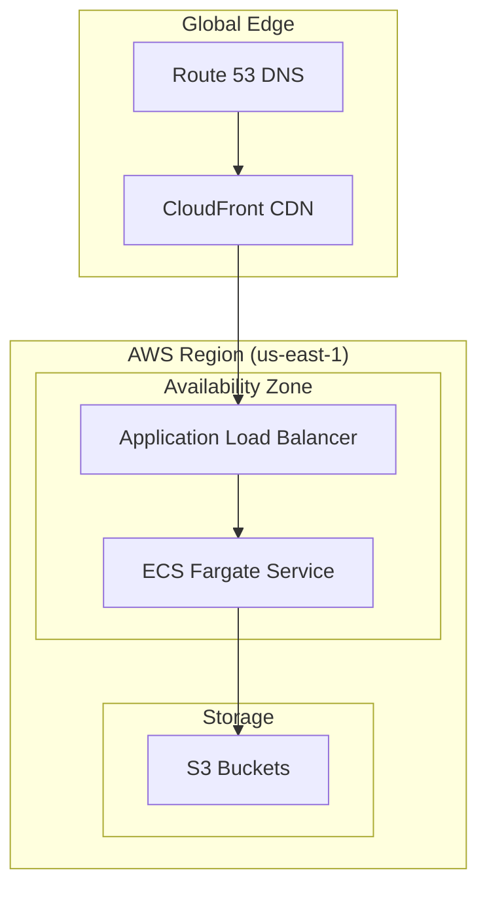

# High-Level Design: AI-Powered Video Translation Service MVP

## Table of Contents
1. [Executive Summary](#executive-summary)
2. [MVP Implementation Decisions](#mvp-implementation-decisions)
3. [Architecture Components](#architecture-components)
4. [Technology Stack](#technology-stack)
5. [Database Schema](#database-schema)
6. [AWS Deployment Architecture](#aws-deployment-architecture)
7. [Conclusion](#conclusion)
---

## Executive Summary

### Objective
Design and implement a **single deployable service** that enables users to upload videos (up to 200MB), processes them using AI to generate translated versions, and provides downloadable MP4 files optimized for global users.

### Key MVP Features
- ✅ Video upload with progress tracking (up to 200MB)
- ✅ Real-time processing status updates via WebSocket
- ✅ Video preview and download functionality
- ✅ Multi-language support
- ✅ RESTful API with OpenAPI documentation
- ✅ Async processing with in-memory job queue
- ✅ Docker containerization for easy deployment

### Architecture Approach
**Monolithic service** with modular components following clean architecture principles, using FastAPI with async processing. Designed for local development simplicity while maintaining extensibility for AWS deployment.

---

## MVP Implementation Decisions

Based on clarifying questions and requirements, the following implementation decisions were made:

### 1. Model Management
**Decision**: Pre-download and cache the following models in memory:
- **Whisper**: `openai/whisper-large-v3` (primary STT model)
- **NLLB Translation**: 
  - `facebook/nllb-200-3.3B` (high quality)
  - `facebook/nllb-200-1.3B` (fallback for resource constraints)
- **MMS TTS**: `facebook/mms-tts-*` (language-specific models loaded on-demand)

**Implementation**: AI Service Factory with in-memory caching strategy

### 2. Language Support
**Decision**: Support multiple languages with full 200+ language capability


### 3. Storage & Queue Strategy
**Decision**: Simplified MVP approach for development and demo:
- **Job Queue**: In-memory singleton with async processing (future: extendible to Redis)
- **File Storage**: Local filesystem with S3 integration capability (configurable via environment variable)
- **Progress Tracking**: In-memory callbacks with WebSocket broadcasting


### 4. Processing Architecture
**Decision**: Async processing with job queue
- Non-blocking API endpoints
- Concurrent job processing with semaphore control
- Real-time progress updates via WebSocket
- Background job processor with error handling

### 5. Frontend Integration
**Decision**: API-first approach with file upload and download URLs:
- RESTful endpoints for all operations
- WebSocket for real-time updates
- OpenAPI documentation for easy frontend development
---

### Core Principles
1. **Single Responsibility**: Each component has a clear, focused purpose
2. **Dependency Inversion**: High-level modules depend on abstractions
3. **Strategy Pattern**: Pluggable AI services for future extensibility
4. **Async Processing**: Non-blocking operations for better performance
5. **MVP Simplicity**: Local development with AWS deployment in mind

---

## Architecture Components

#### Key API Endpoints
```python
# Upload API
POST /api/v1/upload
- Multipart file upload with metadata
- Returns job_id for tracking

# Job Status API
GET /api/v1/jobs/{job_id}/status
- Real-time processing status
- Progress percentage and current stage

# Download API
GET /api/v1/jobs/{job_id}/download
- Serves processed video file
- CDN-optimized delivery

# Preview API
GET /api/v1/jobs/{job_id}/preview
- Generates preview clips
- Supports time-range selection

# WebSocket for Real-time Updates
WS /api/v1/jobs/{job_id}/progress
- Live progress updates
- Error notifications
```

## Frontend

React frontend with:
- File upload
- Progress tracking
- Download links
- Preview clips

## Project Structure

```
frontend/
app/
├── main.py # FastAPI application
├── translator.py # Adapt existing (remove CLI)
├── api/routes/ # API endpoints
├── services/ # Job queue, processing, AI services
└── models/ # Pydantic data models
```

## Technology Stack

### Backend Framework
- **FastAPI (Python 3.10+)**
  - High-performance async framework
  - Built-in OpenAPI documentation
  - WebSocket support for real-time updates
  - Type hints and automatic validation


### Infrastructure & Storage
- **AWS S3**: Object storage for videos
  - Input videos bucket
  - Output videos bucket
  - Temporary processing files

- **SQLite**: Database
  - Job metadata and status
  - User information
  - Processing history

- **In-memory cache**: Caching and job queue
  - Session management
  - Job queue for async processing
  - Real-time progress tracking


### Deployment
- **Docker**: Containerization
- **AWS ECS Fargate**: Serverless container deployment
- **Application Load Balancer**: Traffic distribution
- **CloudFront**: Global CDN for fast delivery

---

## Database Schema

### SQLite Schema

#### Jobs Table
```sql
CREATE TABLE jobs (
    id UUID PRIMARY KEY DEFAULT gen_random_uuid(),
    user_id VARCHAR(255),
    original_filename VARCHAR(255) NOT NULL,
    source_language VARCHAR(10) NOT NULL,
    target_language VARCHAR(10) NOT NULL,
    status VARCHAR(50) NOT NULL DEFAULT 'uploaded',
    input_file_path VARCHAR(500) NOT NULL,
    output_file_path VARCHAR(500),
    input_file_size BIGINT,
    output_file_size BIGINT,
    processing_time_seconds INTEGER,
    error_message TEXT,
    job_metadata JSONB,
    created_at TIMESTAMP WITH TIME ZONE DEFAULT NOW(),
    updated_at TIMESTAMP WITH TIME ZONE DEFAULT NOW(),
    completed_at TIMESTAMP WITH TIME ZONE,
    
    CONSTRAINT valid_status CHECK (status IN (
        'uploaded', 'processing', 'completed', 'failed', 'cancelled'
    ))
);

-- Indexes for performance
CREATE INDEX idx_jobs_user_id ON jobs(user_id);
CREATE INDEX idx_jobs_status ON jobs(status);
CREATE INDEX idx_jobs_created_at ON jobs(created_at);
CREATE INDEX idx_jobs_updated_at ON jobs(updated_at);
```

## AWS Deployment Architecture

### Infrastructure Components



## Conclusion

This High-Level Design document presents a comprehensive architecture for an AI-powered video translation service MVP that meets all the assignment requirements while maintaining extensibility for future enhancements.

### Key Architectural Decisions

1. **Monolithic MVP Approach**: Single deployable service for simplicity while maintaining modular internal architecture
2. **Strategy and Factory Patterns**: Enable easy swapping of AI services (Whisper, NLLB, MMS)
3. **Async Processing**: Non-blocking operations for better performance and scalability
4. **Cloud-Native Design**: Optimized for AWS deployment with auto-scaling capabilities

### MVP Implementation Priority

- Basic upload/download API
- Basic progress tracking
- Simple web frontend
- Video preview functionality
- Documentation and deployment automation

### Technical Benefits

1. **Scalability**: Architecture supports horizontal scaling from day one
2. **Maintainability**: Clean separation of concerns and modular design
3. **Extensibility**: Strategy and Factory patterns enable easy AI service swapping
4. **Performance**: Async processing and caching strategies

This architecture provides a solid foundation for building a production-ready AI-powered video translation service that can scale from MVP to enterprise-level deployment while maintaining code quality, performance, and security standards.
