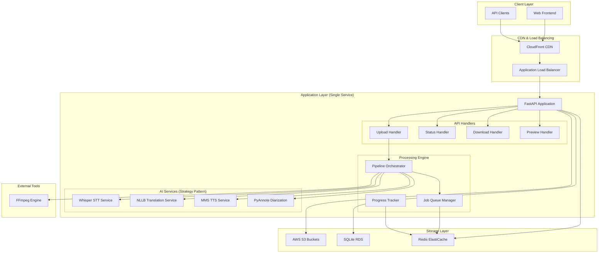
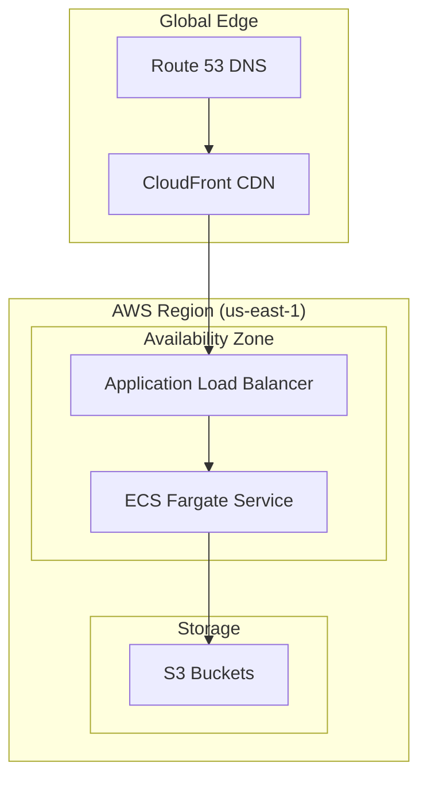

# High-Level Design: AI-Powered Video Translation Service MVP

## Table of Contents
1. [Executive Summary](#executive-summary)
2. [System Overview](#system-overview)
3. [Architecture Components](#architecture-components)
4. [Technology Stack](#technology-stack)
5. [API Design](#api-design)
6. [Database Schema](#database-schema)
7. [AWS Deployment Architecture](#aws-deployment-architecture)
8. [Performance & Scalability](#performance--scalability)

---

## Executive Summary

### Objective
Design and implement a **single deployable service** that enables users to upload videos (up to 200MB), processes them using AI to generate translated versions, and provides downloadable MP4 files optimized for global users.

### Key MVP Features
- ✅ Video upload with progress tracking (up to 200MB)
- ✅ AI-powered video dubbing pipeline (11 stages)
- ✅ Real-time processing status updates
- ✅ Video preview before download
- ✅ Multi-language support
- ✅ Global CDN distribution
- ✅ Basic web frontend

### Architecture Approach
**Monolithic service** with modular components following clean architecture principles, deployed as a single Docker container on AWS ECS Fargate for MVP simplicity while maintaining extensibility.

---

## System Overview

### High-Level System Architecture



### Core Principles
1. **Single Responsibility**: Each component has a clear, focused purpose
2. **Dependency Inversion**: High-level modules depend on abstractions
3. **Strategy Pattern**: Pluggable AI services for future extensibility
4. **Async Processing**: Non-blocking operations for better performance
5. **Cloud-Native**: Designed for AWS deployment and scaling

---

## Architecture Components

### 1. API Layer Components

#### FastAPI Application
```python
# Main application structure
app/
├── main.py                 # FastAPI app initialization
├── api/
│   └── routes/
│       ├── upload.py       # Video upload endpoints
│       ├── jobs.py         # Job management endpoints
│       ├── download.py     # Download endpoints
│       └── preview.py      # Preview endpoints
├── services/
│   ├── ai_services/        # AI service implementations
│   ├── processing/         # Video processing logic
│   └── storage/            # Storage abstractions
└── models/                 # Data models and schemas
```

#### Key API Endpoints
```python
# Upload API
POST /api/v1/upload
- Multipart file upload with metadata
- Returns job_id for tracking

# Job Status API
GET /api/v1/jobs/{job_id}/status
- Real-time processing status
- Progress percentage and current stage

# Download API
GET /api/v1/jobs/{job_id}/download
- Serves processed video file
- CDN-optimized delivery

# Preview API
GET /api/v1/jobs/{job_id}/preview
- Generates preview clips
- Supports time-range selection

# WebSocket for Real-time Updates
WS /api/v1/jobs/{job_id}/progress
- Live progress updates
- Error notifications
```

## Technology Stack

### Backend Framework
- **FastAPI (Python 3.10+)**
  - High-performance async framework
  - Built-in OpenAPI documentation
  - Excellent WebSocket support for real-time updates
  - Type hints and automatic validation


### Infrastructure & Storage
- **AWS S3**: Object storage for videos
  - Input videos bucket
  - Output videos bucket
  - Temporary processing files

- **SQLite**: Database
  - Job metadata and status
  - User information
  - Processing history

- **In-memory cache**: Caching and job queue
  - Session management
  - Job queue for async processing
  - Real-time progress tracking


### Deployment
- **Docker**: Containerization
- **AWS ECS Fargate**: Serverless container deployment
- **Application Load Balancer**: Traffic distribution
- **CloudFront**: Global CDN for fast delivery

---

## API Design

### RESTful API Endpoints

#### Upload API
`/api/v1/upload`

#### Job Status API
`/api/v1/jobs/{job_id}/status`

#### Download API
`/api/v1/jobs/{job_id}/download`


#### Preview API
`/api/v1/jobs/{job_id}/preview`

#### WebSocket for Real-time Updates
`/api/v1/jobs/{job_id}/progress`

---

## Database Schema

### SQLite Schema Design

#### Jobs Table
```sql
CREATE TABLE jobs (
    id UUID PRIMARY KEY DEFAULT gen_random_uuid(),
    user_id VARCHAR(255),
    original_filename VARCHAR(255) NOT NULL,
    source_language VARCHAR(10) NOT NULL,
    target_language VARCHAR(10) NOT NULL,
    status VARCHAR(50) NOT NULL DEFAULT 'uploaded',
    input_file_path VARCHAR(500) NOT NULL,
    output_file_path VARCHAR(500),
    input_file_size BIGINT,
    output_file_size BIGINT,
    processing_time_seconds INTEGER,
    error_message TEXT,
    job_metadata JSONB,
    created_at TIMESTAMP WITH TIME ZONE DEFAULT NOW(),
    updated_at TIMESTAMP WITH TIME ZONE DEFAULT NOW(),
    completed_at TIMESTAMP WITH TIME ZONE,
    
    CONSTRAINT valid_status CHECK (status IN (
        'uploaded', 'processing', 'completed', 'failed', 'cancelled'
    ))
);

-- Indexes for performance
CREATE INDEX idx_jobs_user_id ON jobs(user_id);
CREATE INDEX idx_jobs_status ON jobs(status);
CREATE INDEX idx_jobs_created_at ON jobs(created_at);
CREATE INDEX idx_jobs_updated_at ON jobs(updated_at);
```
### Data Models (Pydantic)

```python
from pydantic import BaseModel, Field
from typing import Optional, Dict, Any
from datetime import datetime
from enum import Enum

class JobStatus(str, Enum):
    UPLOADED = "uploaded"
    PROCESSING = "processing"
    COMPLETED = "completed"
    FAILED = "failed"
    CANCELLED = "cancelled"

class JobCreate(BaseModel):
    user_id: Optional[str] = None
    original_filename: str
    source_language: str = Field(..., min_length=2, max_length=10)
    target_language: str = Field(..., min_length=2, max_length=10)
    input_file_path: str

class JobResponse(BaseModel):
    id: str
    user_id: Optional[str]
    original_filename: str
    source_language: str
    target_language: str
    status: JobStatus
    input_file_path: str
    output_file_path: Optional[str]
    input_file_size: Optional[int]
    output_file_size: Optional[int]
    error_message: Optional[str]
    job_metadata: Optional[Dict[str, Any]]
    created_at: datetime
    updated_at: datetime
    completed_at: Optional[datetime]
```

---

## AWS Deployment Architecture

### Infrastructure Components


## Performance & Scalability

### Performance Optimization Strategies

#### 1. Async Processing Architecture

#### 2. Model Caching and Optimization

## Conclusion

This High-Level Design document presents a comprehensive architecture for an AI-powered video translation service MVP that meets all the assignment requirements while maintaining extensibility for future enhancements.

### Key Architectural Decisions

1. **Monolithic MVP Approach**: Single deployable service for simplicity while maintaining modular internal architecture
2. **Strategy and Factory Patterns**: Enable easy swapping of AI services (Whisper, NLLB, MMS)
3. **Async Processing**: Non-blocking operations for better performance and scalability
4. **Cloud-Native Design**: Optimized for AWS deployment with auto-scaling capabilities

### MVP Implementation Priority

- Basic upload/download API
- Basic progress tracking
- Simple web frontend
- Video preview functionality
- Documentation and deployment automation

### Technical Benefits

1. **Scalability**: Architecture supports horizontal scaling from day one
2. **Maintainability**: Clean separation of concerns and modular design
3. **Extensibility**: Strategy and Factory patterns enable easy AI service swapping
4. **Performance**: Async processing and caching strategies

This architecture provides a solid foundation for building a production-ready AI-powered video translation service that can scale from MVP to enterprise-level deployment while maintaining code quality, performance, and security standards.
