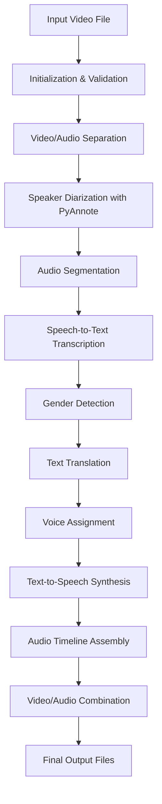

### **Backend Development Assignment Brief: AI-Powered Video Translation Service**

#### **Objective**

Design and implement a backend service that enables users to upload a video, processes the video to generate a translated version using AI and FFmpeg, and provides a downloadable MP4 file. The system must be optimized for speed, accuracy, and scalability to serve a **global** user base.

---

### **Requirements**

#### **Core Functionality**

1. **Video Upload interface \+ API**

   * Provide an API endpoint and a basic frontend to upload videos.  
   * Support file sizes up to **200MB**.  
   * Ensure fast and reliable upload from global users.

2. **Cloud Storage Integration**

   * Store uploaded videos in a cloud storage solution.  
   * Store both original and processed (translated) videos.

3. **Video Processing Pipeline**

   * Use desired **AI services** to:  
     * Transcribe and translate video audio to another language.

   * Use **FFmpeg** to:  
     * Replace the original audio track with the translated version.  
     * Ensure audio/video synchronization and proper encoding.

4. **Downloadable Output**

   * Generate and serve a downloadable **MP4** file of the translated video.

---

### **Goals**

* **Speed**

  * Minimize upload and download latency for users worldwide.  
  * Optimize video processing time.

* **Accuracy**

  * Ensure high-quality transcription and translation.  
  * Maintain synchronization between translated audio and video.

* **Scalability**

  * Handle multiple concurrent uploads and processing jobs.  
  * Design with global accessibility and performance in mind.

---

### **Additional Requirements**

* Support multiple language options for translation.  
* Add real-time progress tracking for uploads and processing.  
* Enable video preview before download.
* Basic frontend to upload videos and download the translated video.

## Video Dubbing Process Pipeline

