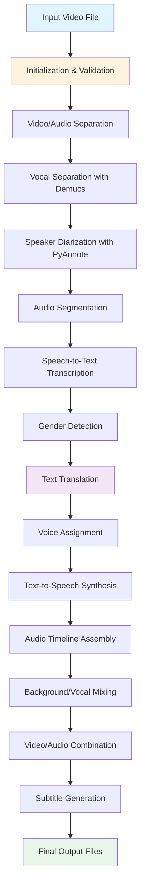
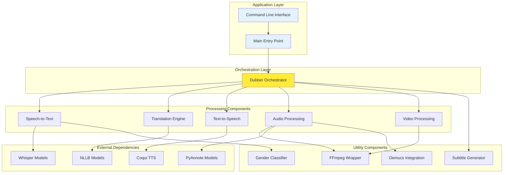
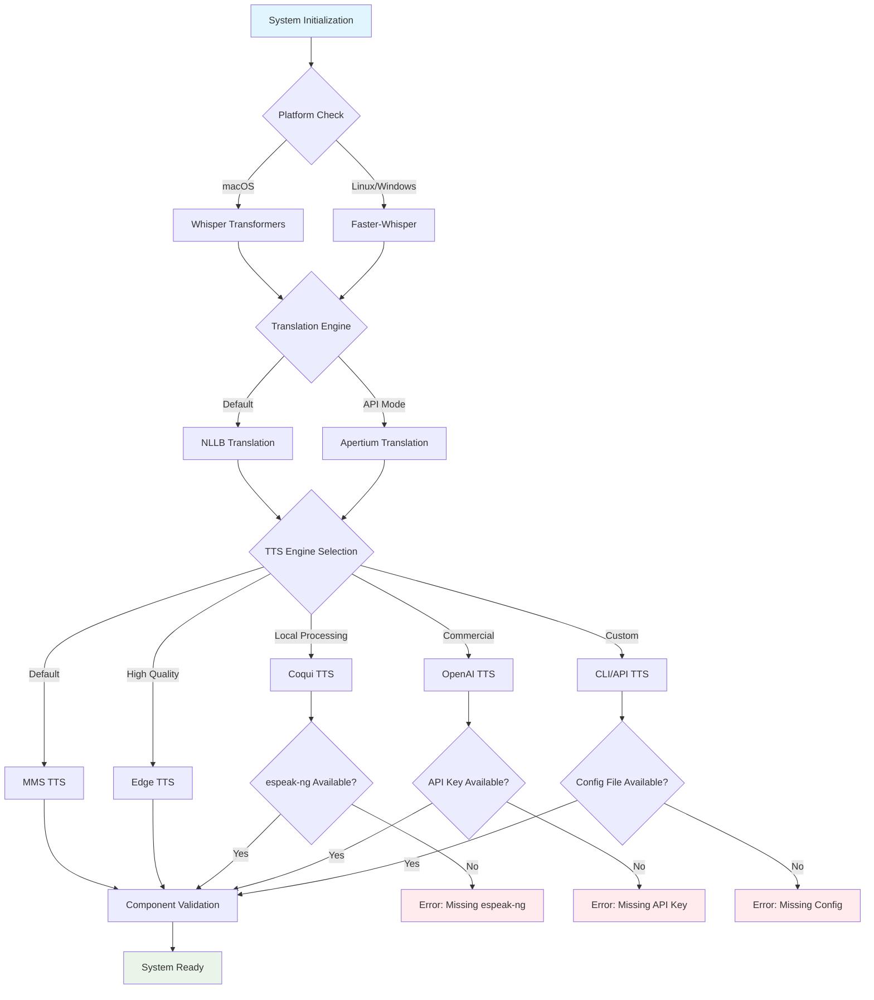
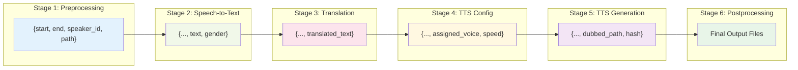
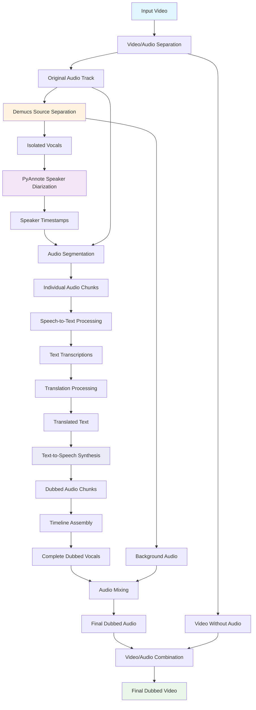
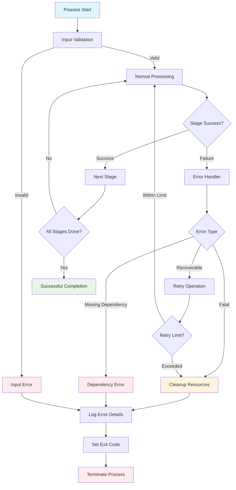
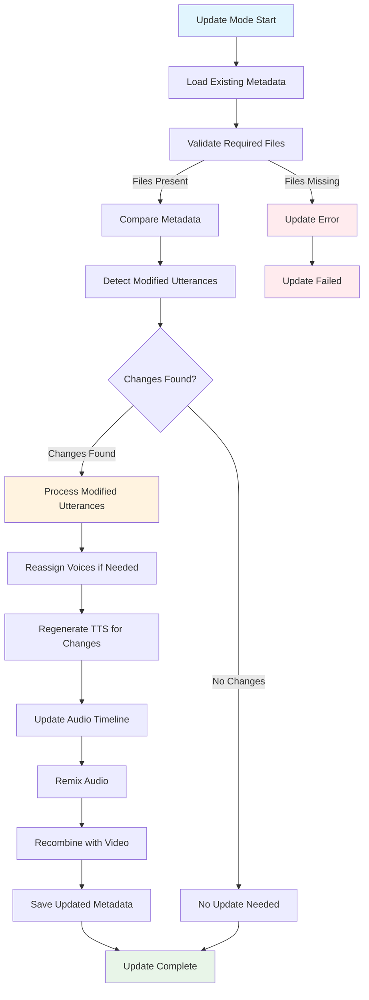
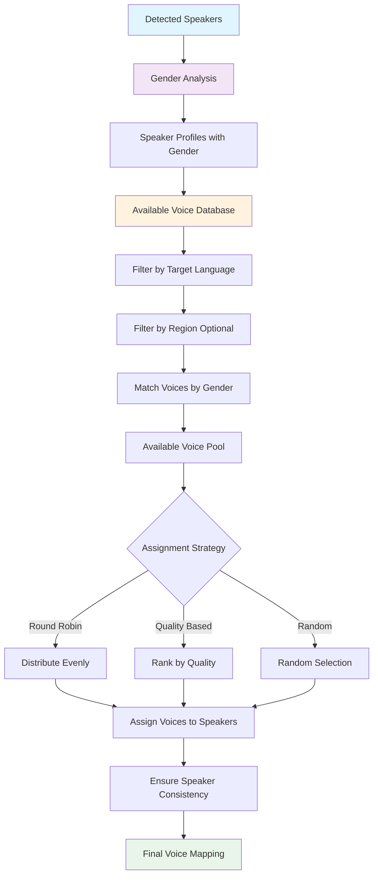
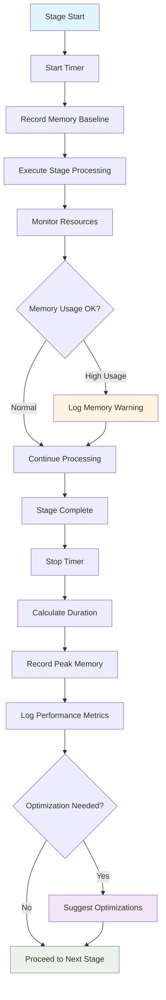

# Flow Diagrams

This document provides visual representations of the major flows and processes in the open-dubbing system using Mermaid diagrams.

## 1. High-Level System Flow

This diagram shows the complete dubbing pipeline from input to output:

**Purpose:** Provides a bird's-eye view of the entire dubbing process, showing how input video transforms through various stages to produce the final dubbed output.

## 2. Component Interaction Diagram

This diagram illustrates how the major components interact with each other:

**Purpose:** Shows the dependency relationships and communication patterns between different system components.

## 3. Engine Selection Decision Tree

This diagram shows how the system selects appropriate engines based on configuration:

**Purpose:** Illustrates the decision-making process for selecting appropriate processing engines based on platform, availability, and configuration.

## 4. Data Flow Through Pipeline

This diagram shows how the utterance metadata evolves through each processing stage:

**Purpose:** Demonstrates how the central metadata structure grows and evolves as it passes through each processing stage.

## 5. Audio Processing Workflow

This diagram details the audio processing pipeline:

**Purpose:** Shows the detailed audio processing workflow, including source separation, diarization, and final mixing.

## 6. Error Handling and Recovery Flow

This diagram illustrates the error handling mechanisms:

**Purpose:** Demonstrates the comprehensive error handling strategy, including validation, recovery attempts, and graceful degradation.

## 7. Update Mode Workflow

This diagram shows the post-editing update process:

**Purpose:** Illustrates the efficient update workflow that allows post-editing of dubbing results without full reprocessing.

## 8. Voice Assignment Logic

This diagram shows how voices are assigned to speakers:

**Purpose:** Details the sophisticated voice assignment algorithm that matches synthetic voices to original speakers based on gender and other characteristics.

## 9. Performance Monitoring Flow

This diagram shows the performance monitoring and optimization workflow:

**Purpose:** Shows how the system continuously monitors performance and provides optimization recommendations.

## 10. File Output Structure

This diagram illustrates the complete file output organization:

```mermaid
graph TD
    OUTPUT[Output Directory] --> FINAL_FILES[Final Output Files]
    OUTPUT --> METADATA[Metadata Files]
    OUTPUT --> INTERMEDIATE[Intermediate Files]
    OUTPUT --> SUBTITLES[Subtitle Files]
    
    FINAL_FILES --> DUBBED_VIDEO[dubbed_video_lang.mp4]
    FINAL_FILES --> DUBBED_AUDIO[dubbed_audio_lang.mp3]
    
    METADATA --> UTTERANCE_META[utterance_metadata_lang.json]
    METADATA --> PREPROCESSING[preprocessing_artifacts.json]
    
    INTERMEDIATE --> VIDEO_ONLY[filename_video.mp4]
    INTERMEDIATE --> AUDIO_ONLY[filename_audio.wav]
    INTERMEDIATE --> VOCALS[vocals.wav]
    INTERMEDIATE --> BACKGROUND[no_vocals.wav]
    INTERMEDIATE --> CHUNKS[chunk_*.mp3]
    INTERMEDIATE --> DUBBED_CHUNKS[dubbed_chunk_*.mp3]
    
    SUBTITLES --> SOURCE_SUBS[source_language.srt]
    SUBTITLES --> TARGET_SUBS[target_language.srt]
    
    style OUTPUT fill:#e1f5fe
    style FINAL_FILES fill:#e8f5e8
    style METADATA fill:#fff3e0
    style INTERMEDIATE fill:#f3e5f5
    style SUBTITLES fill:#e8eaf6
```

**Purpose:** Shows the comprehensive file organization structure, including final outputs, metadata for post-editing, intermediate processing files, and optional subtitle files.

## Summary

These flow diagrams provide visual representations of the key processes and data flows in the open-dubbing system:

1. **High-Level System Flow**: Complete pipeline overview
2. **Component Interaction**: System architecture and dependencies
3. **Engine Selection**: Decision-making for component selection
4. **Data Flow**: Metadata evolution through processing stages
5. **Audio Processing**: Detailed audio manipulation workflow
6. **Error Handling**: Comprehensive error management strategy
7. **Update Mode**: Post-editing and incremental updates
8. **Voice Assignment**: Speaker-to-voice matching algorithm
9. **Performance Monitoring**: Resource tracking and optimization
10. **File Output**: Complete output file organization

Each diagram serves a specific purpose in understanding different aspects of the system, from high-level architecture to detailed processing workflows. Together, they provide a comprehensive visual guide to the open-dubbing system's operation and design.
